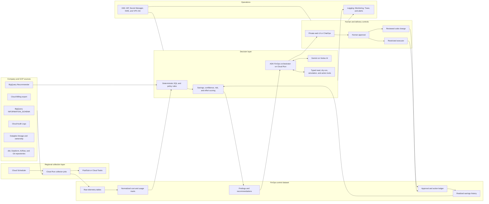

# BigQuery FinOps Agent on Google Cloud

**Solution architecture report — 31 August 2026**

## 1. Executive recommendation

Build a **BigQuery FinOps Agent** that continuously collects BigQuery usage and storage telemetry, detects optimization opportunities with deterministic rules, uses an LLM to diagnose and explain them, proposes validated remediations, and measures realized savings after deployment.

Recommended technology choices:

| Area | Recommendation |
|---|---|
| Primary language | **Python 3.12** |
| Analytics language | **GoogleSQL** |
| Agent framework | **Google Agent Development Kit (ADK), Python** |
| Model access | **Vertex AI through the Google Gen AI SDK** |
| Runtime | **Cloud Run service** for the API; **Cloud Run jobs** for collection and batch analysis |
| Workflow/eventing | Cloud Scheduler, Pub/Sub or Cloud Tasks, and Workflows where durable orchestration is needed |
| Operational store | BigQuery for telemetry, findings, forecasts, and audit history; Firestore only for interactive session or approval state if needed |
| Infrastructure | Terraform |
| CI/CD | Cloud Build and Artifact Registry, or the company's existing approved CI platform |
| Observability | Cloud Logging, Monitoring, Trace, Error Reporting, and OpenTelemetry |
| Security | Separate least-privilege service accounts, private Cloud Run ingress, IAP, Secret Manager, CMEK where required, and VPC Service Controls for sensitive environments |

The first production version should be **one orchestrating agent with typed tools**, not a swarm of independent agents. Specialist modules can be separated later, but one controlled workflow is easier to test, secure, audit, and operate.

## 2. Why Python

Python is the best default for this solution because:

- Google ADK and Google Cloud's data/AI SDKs have strong Python support.
- BigQuery administration, SQL analysis, forecasting, and anomaly detection fit Python's data ecosystem.
- Typed tool contracts can be implemented with Pydantic.
- SQL can be parsed and transformed with a dialect-aware parser such as SQLGlot rather than unreliable regular expressions.
- The team can keep the API, batch analyzers, evaluation framework, and agent tools in one language.

Use other languages only where they add value:

- **GoogleSQL** for telemetry marts, rules, savings calculations, and historical analysis.
- **Terraform/HCL** for infrastructure and IAM.
- **TypeScript** only if a richer internal web interface is required.

Java is a reasonable alternative for a Java-first organization, and ADK supports Java, but it provides less leverage for the analytical and experimental parts of this use case. Go would be attractive for lightweight collectors, but mixing languages is unnecessary at the start.

## 3. Agent-framework decision

| Option | Fit | Advantages | Limitations | Decision |
|---|---:|---|---|---|
| Google ADK | **9/10** | GCP-native, model/tool orchestration, sessions, evaluation support, Cloud Run and Agent Runtime paths, MCP/A2A support | More Google-oriented than neutral frameworks | **Recommended** |
| LangGraph | 8/10 | Explicit durable graphs, strong control over state, good model portability | More integration work for a GCP-native operating model | Strong fallback when portability is mandatory |
| Raw Google Gen AI SDK | 6/10 | Minimal dependencies and maximum control | The team must build orchestration, state, retries, tool routing, and evaluations | Suitable only for a very small proof of concept |
| Fully custom framework | 3/10 | Complete control | High engineering and maintenance cost with little initial business benefit | Do not start here |

ADK is a code-first framework and supports multiple languages. Cloud Run can host ADK and other agent frameworks, while Google Agent Runtime provides a more opinionated managed-agent environment. [ADK documentation](https://google.github.io/adk-docs/), [Cloud Run agent hosting](https://docs.cloud.google.com/run/docs/ai-agents)

### Framework design rule

The LLM must never be the system of record for cost, savings, ownership, or approval. It receives structured evidence and returns structured proposals. Deterministic code validates every proposal.

## 4. Reference architecture



### Important regional design

Many BigQuery `INFORMATION_SCHEMA` views are region-scoped, and the query location must match the view's region. Every onboarded project therefore has a registry entry containing all of its BigQuery locations and its impersonation identities. Adding an enabled project publishes an immediate collection event; scheduled runs enumerate the same registry. A regional collection call reads the target project with its impersonated reader identity and writes normalized results to the central FinOps dataset with the control-plane identity. Do not assume a single US or EU query can inspect every company project.

BigQuery job metadata is available for approximately 180 days, while high-resolution job and reservation timeline data generally has shorter retention. Persist the required telemetry in partitioned history tables for long-term baselines. [BigQuery troubleshooting guidance](https://docs.cloud.google.com/bigquery/docs/info-schema-troubleshoot)

## 5. Logical agent design

### Orchestrator

The FinOps orchestrator accepts a scheduled event or user request, retrieves structured findings, chooses the appropriate diagnostic workflow, calls only allowed tools, and returns a recommendation with evidence.

### Specialist capabilities

These should initially be Python modules or ADK sub-agents behind the same orchestrator:

1. **Cost attribution:** maps jobs to projects, users, service accounts, pipelines, dashboards, products, and cost centers.
2. **Anomaly diagnosis:** explains unexpected compute or storage changes and identifies the responsible jobs or assets.
3. **Query optimization:** detects waste patterns, proposes SQL changes, dry-runs them, and compares output safely.
4. **Storage lifecycle:** finds unused, duplicated, unowned, or over-retained data and proposes lifecycle actions.
5. **Table design:** consumes native and custom partitioning, clustering, and materialized-view signals.
6. **Capacity optimization:** models reservation utilization, concurrency, autoscaling, and pricing choices.
7. **Remediation planning:** turns findings into code changes or tightly scoped infrastructure actions.
8. **Outcome measurement:** compares expected and realized savings while watching latency and reliability.

BigQuery exposes native partition/clustering and materialized-view recommendations through the Recommender service and `INFORMATION_SCHEMA.RECOMMENDATIONS`. Native recommendations should be treated as high-quality input, not duplicated blindly by the LLM. [Recommendations view](https://docs.cloud.google.com/bigquery/docs/information-schema-recommendations), [partition and clustering recommender](https://docs.cloud.google.com/bigquery/docs/manage-partition-cluster-recommendations)

## 6. Tool design

Every agent tool should have a strongly typed request and response schema, explicit authorization class, timeout, row/byte limit, and audit record.

### Read-only tools

- `get_cost_summary(period, scope)`
- `get_expensive_jobs(scope, period, limit)`
- `get_job_execution_plan(job_id)`
- `get_table_storage(table_ref)`
- `get_table_usage(table_ref, period)`
- `get_lineage(table_ref)`
- `get_reservation_utilization(reservation, period)`
- `get_native_recommendations(scope)`
- `find_query_pattern_examples(fingerprint)`

### Validation and simulation tools

- `dry_run_query(sql, location, max_bytes)`
- `compare_query_results(original, candidate, test_windows)`
- `estimate_monthly_savings(change, workload_baseline)`
- `simulate_reservation_change(configuration)`
- `validate_table_migration(plan)`
- `check_policy(change)`

### Mutating tools

- `create_change_request(proposal)`
- `open_repository_change(proposal)`
- `apply_expiration_change(target, approved_request)`
- `cancel_job(job_id, approved_policy)`
- `update_reservation(config, approved_request)`

Mutating tools must not be available to the ordinary diagnostic service account. Route them to a separate executor identity after approval and policy validation.

## 7. Data model

Create a dedicated dataset such as `finops_control` containing:

| Table | Purpose | Suggested partition/cluster |
|---|---|---|
| `jobs_history` | Job cost and performance facts | Partition by creation date; cluster by project, user, query fingerprint |
| `job_stage_history` | Execution-plan and stage facts | Partition by job date; cluster by job ID |
| `table_storage_history` | Logical, physical, time-travel, and fail-safe bytes | Partition by snapshot date; cluster by project and dataset |
| `table_usage_history` | Reads, writes, users, and downstream use | Partition by date; cluster by table reference |
| `reservation_history` | Slot capacity, utilization, contention, and autoscaling | Partition by timestamp; cluster by reservation |
| `billing_cost` | Reconciled BigQuery billing export | Use the export's time partitioning; cluster by project and SKU |
| `asset_ownership` | Owner, product, SLA, sensitivity, retention policy | Cluster by project and dataset |
| `findings` | Detected optimization opportunities | Partition by detection date; cluster by status, owner, category |
| `recommendations` | Agent-generated proposals and evidence | Partition by creation date; cluster by impact and state |
| `action_ledger` | Approval, execution, rollback, and audit state | Partition by event date; cluster by action and target |
| `outcomes` | Realized savings and guardrail metrics | Partition by measurement date; cluster by recommendation ID |

Store a normalized query fingerprint for grouping. Restrict or redact raw SQL because it can contain confidential literals. Retain raw query text only where policy permits.

## 8. Model strategy

Use two model tiers configured through environment settings rather than hard-coded throughout the codebase:

- **Fast tier:** the current approved stable Gemini Flash-family model for classification, evidence summarization, ownership messages, and simple explanations.
- **Reasoning tier:** the current approved stable Gemini Pro-family model for difficult SQL diagnosis, remediation planning, and architecture trade-offs.

Do not use preview models for production actions unless the company explicitly accepts preview terms and has passed regression evaluations. Pin the evaluated production model version or controlled alias, and make model upgrades pass the same evaluation suite as code changes.

Use low temperature, structured output, and typed function calling. Google recommends validating function calls that cause consequential updates before executing them. [Vertex AI function-calling guidance](https://docs.cloud.google.com/vertex-ai/generative-ai/docs/multimodal/function-calling)

The model should not:

- calculate authoritative savings without deterministic verification;
- execute generated SQL with unrestricted credentials;
- decide that a production table can be deleted;
- receive more raw company data than is needed for the task;
- infer approval from conversational language.

## 9. Runtime choice

### Recommended initial runtime: Cloud Run

Use:

- a **private Cloud Run service** for the ADK API and user interactions;
- **Cloud Run jobs** for regional telemetry collection, scheduled detection, backfills, and evaluation runs;
- **Pub/Sub or Cloud Tasks** to decouple slow analysis from interactive requests;
- **Cloud Scheduler** to initiate periodic collection;
- **Workflows** only for durable, multi-step processes where execution state and compensation matter.

Cloud Run services suit stateless request-driven agents, jobs suit run-to-completion workflows, and worker pools can support queue-consuming agent fleets if the workload later requires them. [Cloud Run AI-agent architecture](https://docs.cloud.google.com/run/docs/ai-agents)

### When to choose Agent Runtime instead

Evaluate Google Agent Runtime later if managed agent sessions, memory, deployment, and agent-specific operations outweigh the need for runtime control. Cloud Run is the safer initial fit because this solution is primarily scheduled FinOps analysis plus controlled APIs, not a memory-heavy conversational assistant. The application design keeps business logic independent enough to migrate later. [Google architecture selection guide](https://docs.cloud.google.com/architecture/choose-agentic-ai-architecture-components)

### When GKE is justified

Use GKE only if the company already standardizes on Kubernetes and needs service-mesh controls, custom sidecars, unusual networking, sustained workers, or specialized runtime requirements. It introduces unnecessary operational overhead for the initial solution.

## 10. Security and governance

### Identity separation

Use these identities:

1. **Control-plane application identity:** runs Cloud Run, writes only to the FinOps control dataset, calls Vertex AI, and publishes collection events. It receives no direct BigQuery role in target projects.
2. **Per-project reader identity:** is impersonated for regional metadata collection and dry runs. Security owns its target-project roles.
3. **Per-project executor identity:** is optional, distinct from the reader, and contains only the approved mutation permissions for that project.
4. **Scheduler/push identity:** may invoke the private Cloud Run service but cannot access BigQuery target projects.
5. **CI/CD identity:** deploys the application without production-data access.

The control-plane identity receives `roles/iam.serviceAccountTokenCreator` only on explicitly registered target identities. All credentials are short-lived. Prefer custom roles and authorized views where standard roles are broader than needed, and never create service-account keys.

### Network and data controls

- Private Cloud Run ingress and Identity-Aware Proxy for the internal UI.
- VPC Service Controls around BigQuery, Vertex AI, Cloud Storage, and agent resources where sensitivity warrants it.
- Secret Manager for external integration credentials.
- Customer-managed encryption keys where required by company policy.
- Organization policies to restrict regions and public endpoints.
- Model Armor or equivalent input/output controls when content can come from untrusted sources.
- Logging with prompt and response content disabled by default; enable sampled content only in a protected evaluation environment.

VPC Service Controls adds a data-exfiltration boundary beyond IAM and now includes controls relevant to agent identities and MCP tools. [VPC Service Controls](https://cloud.google.com/security/vpc-service-controls)

### Autonomy levels

| Level | Behavior | Initial use |
|---|---|---|
| A0 | Observe and report | All findings |
| A1 | Draft SQL, configuration, ticket, or pull request | Query and table-design changes |
| A2 | Execute after explicit human approval | Expiration changes, schedule changes, bounded cancellations |
| A3 | Automatically execute pre-approved low-risk policies | Expired scratch assets and known runaway-query policies only |
| A4 | Broad autonomous production changes | **Not recommended** |

Deletion, retention reduction, reservation commitments, permissions, and production migrations should remain A1 or A2.

## 11. Recommendation scoring

Rank each finding with a transparent score rather than asking the LLM for a single subjective priority:

`priority = expected_monthly_savings × confidence × recurrence × business_weight ÷ (effort × risk)`

Persist the underlying factors:

- expected monthly compute and storage savings;
- confidence interval and evidence period;
- implementation effort;
- data correctness and availability risk;
- blast radius;
- owner and business criticality;
- rollback readiness;
- recommendation age.

The model may explain the score, but deterministic code must calculate it.

## 12. End-to-end workflows

### Daily detection

1. Regional collector jobs read recent metadata and recommendations.
2. SQL transformations update normalized marts.
3. Deterministic detectors create or refresh findings.
4. The agent enriches high-value findings with diagnosis and proposed actions.
5. Policy checks suppress unsafe or low-confidence proposals.
6. Owners receive a ranked digest with evidence and estimated savings.

### Query remediation

1. Select a high-cost recurring query fingerprint.
2. Retrieve representative SQL, job statistics, execution plan, table design, and lineage.
3. Produce one or more candidate rewrites.
4. Parse and policy-check the SQL.
5. Dry-run candidates with byte limits.
6. Compare results on safe historical windows.
7. Estimate recurring savings from measured bytes or slot time.
8. Open a reviewed repository change.
9. After deployment, compare cost, duration, errors, and data-quality metrics.

### Storage remediation

1. Find an unused or over-retained asset.
2. Verify lineage, recent reads/writes, ownership, policy, sensitivity, and recovery requirements.
3. Choose expiration, archival, snapshot, clone, consolidation, or no action.
4. Require approval from the owner and data-governance policy where applicable.
5. Execute through the restricted identity.
6. Record rollback information and realized savings.

## 13. Suggested Python libraries

| Purpose | Library |
|---|---|
| Agent orchestration | `google-adk` |
| Model API | `google-genai` using Vertex AI authentication |
| BigQuery | `google-cloud-bigquery`, `google-cloud-bigquery-storage` where justified |
| Recommendations | Generated Google Cloud Recommender client or REST client |
| API/schema validation | `pydantic` |
| SQL parsing | `sqlglot` with the BigQuery dialect |
| API layer | ADK API server or `fastapi` for a custom control API |
| Retry policies | Google API Core retry primitives; `tenacity` only where needed outside Google clients |
| Telemetry | OpenTelemetry plus Google Cloud exporters |
| Testing | `pytest`, property-based tests where valuable, and ADK evaluation tooling |
| Forecasting/anomaly models | Begin with BigQuery SQL/BigQuery ML; add Python statistical libraries only when they outperform simple baselines |

Pin dependencies with lock files and automate vulnerability and license checks. Avoid introducing LangChain merely for convenience if ADK already provides the required orchestration.

## 14. Repository structure

```text
bigquery-finops-agent/
  app/
    agents/             # orchestrator and specialist modules
    tools/              # typed read, validation, and action tools
    policies/           # deterministic safety and approval rules
    services/           # BigQuery, Recommender, billing, lineage clients
    api/                # private API and approval endpoints
    models/             # Pydantic contracts
  sql/
    collectors/
    marts/
    detectors/
    validation/
  evals/
    datasets/
    expected_actions/
    adversarial/
  tests/
    unit/
    integration/
    policy/
  infra/
    terraform/
      modules/
      environments/dev/
      environments/stage/
      environments/prod/
  dashboards/
  docs/
  Dockerfile
  pyproject.toml
```

## 15. Testing and evaluation

### Conventional tests

- Unit-test cost calculations, query fingerprints, parsers, and policies.
- Integration-test every tool against a sandbox GCP project.
- Use contract tests for BigQuery and Recommender responses.
- Validate Terraform and IAM policies automatically.
- Test idempotency, retries, regional failures, and duplicate events.

### Agent evaluations

Build a versioned evaluation dataset containing:

- known expensive queries and accepted diagnoses;
- safe and unsafe rewrite examples;
- ambiguous ownership and retention scenarios;
- attempts to bypass approval;
- prompt-injection strings embedded in SQL comments, labels, and table descriptions;
- cases where the correct action is “do nothing”;
- model-upgrade regression cases.

Measure:

- finding precision and recall;
- SQL semantic-equivalence pass rate;
- invalid tool-call rate;
- unsafe-action rate, targeted at zero;
- savings-estimate error;
- explanation usefulness judged by data engineers;
- latency and model cost per analyzed finding.

Enable end-to-end traces for model and tool calls, but protect prompt content. Google Cloud supports tracing agent operations through Cloud Trace and OpenTelemetry. [Agent tracing](https://docs.cloud.google.com/vertex-ai/generative-ai/docs/agent-engine/manage/tracing)

## 16. Observability and SLOs

Recommended operational metrics:

- collection completeness by project and region;
- telemetry freshness;
- findings created, accepted, rejected, and expired;
- expected versus realized monthly savings;
- false-positive and rollback rates;
- agent/tool/model error rate;
- approval lead time;
- model tokens and cost per finding;
- Cloud Run latency, concurrency, instance count, and failure rate;
- BigQuery bytes or slot time consumed by the FinOps system itself.

Suggested initial objectives:

- 99% of configured projects collected within the agreed daily window;
- no unapproved destructive production actions;
- less than 5% false-positive rate among high-confidence recommendations after tuning;
- every executed action linked to evidence, approval, executor identity, and rollback plan;
- the FinOps platform's operating cost below 5% of verified savings.

## 17. Complete deployment and activation

The repository ships collection, detection, ADK interaction, approval, and restricted execution together; they are not separate implementation phases. Deployment activation is controlled through permissions and project configuration:

1. Deploy the control dataset, Pub/Sub, scheduler, Cloud Run service, IAM identities, and monitoring from Terraform.
2. Let security create each target reader/executor identity and approve its least-privilege roles.
3. Grant the control-plane identity impersonation rights only on those explicit target identities.
4. Register a project with its locations and reader/executor identities. This triggers immediate collection.
5. Confirm findings, dry runs, traces, and cost assumptions using historical workloads.
6. Keep the project at A0/A1 if it should only report or draft. Enable approval-bound execution only where an executor identity exists.
7. Connect the company Git, ticketing, or ChatOps adapter without changing the security boundary.

All technical capabilities can be deployed at once while production mutation remains disabled by the absence of executor permissions and approved action records.

## 18. Team model

A practical initial team is:

- one senior data/platform engineer;
- one Python/AI engineer;
- a BigQuery administrator or FinOps specialist at least part-time;
- a security/IAM reviewer part-time;
- representative data-product owners for evaluation and acceptance.

The product owner should be accountable for realized savings and adoption, not merely the number of generated recommendations.

## 19. Key risks and mitigations

| Risk | Mitigation |
|---|---|
| Plausible but wrong SQL rewrite | Parser checks, dry run, bounded comparison, data-quality tests, and human review |
| Incorrect deletion or retention action | Lineage, ownership, policy checks, snapshots/rollback, and mandatory approval |
| Savings estimates do not match billing | Reconcile with billing export and report confidence intervals |
| Prompt injection through metadata or SQL comments | Treat retrieved content as untrusted, isolate it from instructions, use allow-listed tools and deterministic policy checks |
| Excessive permissions | Separate identities and keep mutation behind an approval-bound executor |
| LLM operating cost erodes savings | Analyze only prioritized findings, use a fast model by default, cache evidence, and batch work |
| Regional or retention gaps | Region-aware collection and persistent telemetry history |
| Recommendation fatigue | Rank by verified savings, suppress duplicates, expire stale findings, and track owner feedback |
| Model or framework change | Pin versions, keep business logic outside prompts, and require regression evaluations for upgrades |

## 20. Final decision

Proceed with **Python + Google ADK + Vertex AI + Cloud Run**, supported by BigQuery telemetry marts and deterministic policy engines. Start with a single private, read-only agent. Add separate approval and execution paths only after recommendation precision and savings estimates have been proven.

The architecture's most important principle is separation of concerns:

- BigQuery and deterministic code produce facts and calculations.
- The LLM diagnoses, explains, and drafts.
- Policies decide what is allowed.
- Humans approve material changes.
- A restricted executor applies approved actions.
- The outcome pipeline verifies whether savings actually occurred.

That design captures the value of an AI agent without making BigQuery production administration depend on probabilistic behavior.
